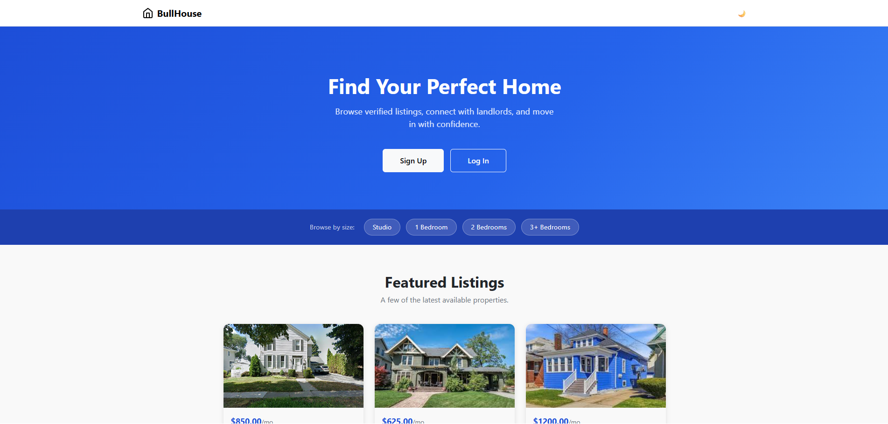
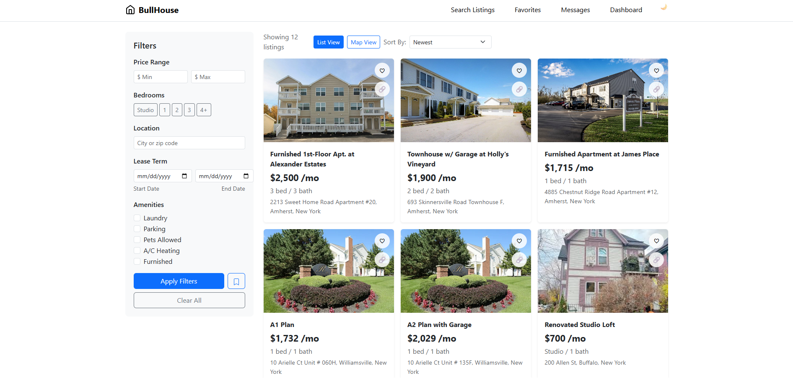
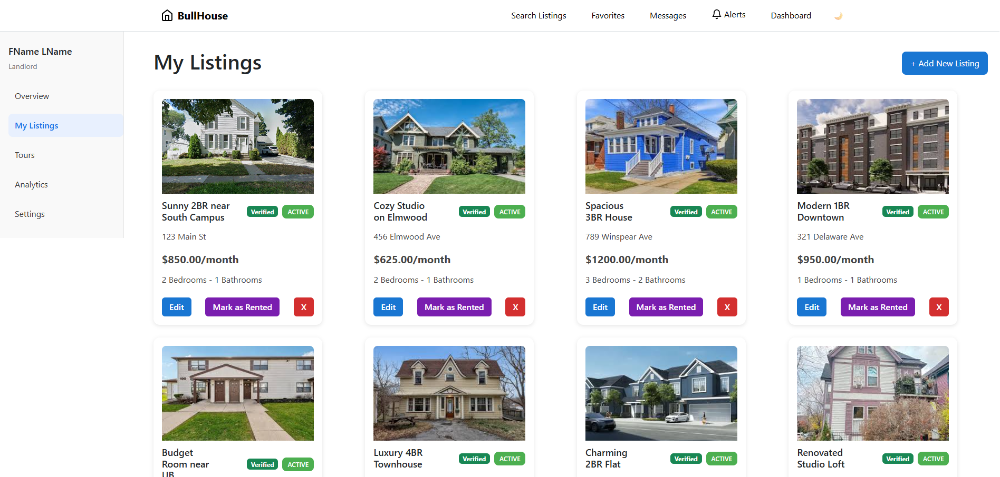
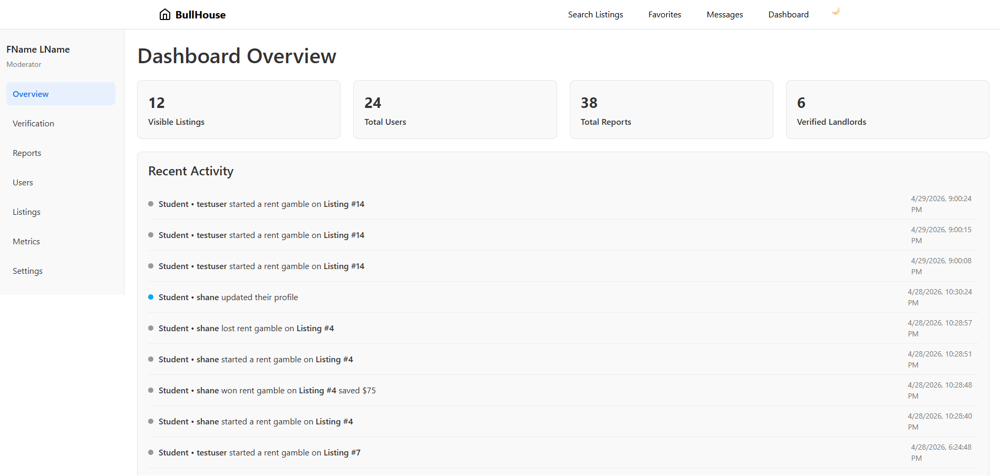

# Bullhouse Case Study
Full-stack student housing and roommate-matching platform built with React, PHP, and MySQL — case study covering architecture, engineering decisions, and my contributions.

> **Note:** This is a write-up of work I did on a team project for Software Engineering at the University at Buffalo. The original repository lives in a private GitHub Classroom organization and can't be published here due to UB's academic integrity guidelines. This document describes the system, my role, and the engineering decisions involved — no source code from the original repository is reproduced.

## What is BullHouse

BullHouse is a housing and roommate-matching platform built for UB students. It lets landlords list off-campus properties, lets students search/filter listings and find compatible roommates, and gives admins tools to moderate the platform (user management, listing verification, report handling, and usage metrics).

The product spans three user roles with distinct portals:
- **Students** — search listings, save searches/favorites, swipe-match with potential roommates, message landlords and other students, schedule tours, leave reviews.
- **Landlords** — create/edit/manage listings, view analytics on their properties, handle tour requests, get verified.
- **Admins** — manage users, review/verify landlord documents, moderate flagged listings/reviews, view platform-wide metrics, audit activity logs.

Built over a full semester (Feb–Apr 2026) by a team of ~6 engineers, with feature work tracked through ~190 PRs and 600+ commits on a shared `dev` branch, merged through code review.

## Screenshots

## Tech stack

| Layer | Technology |
|---|---|
| Frontend | React 18 + Vite, React Router, Bootstrap, Recharts (analytics charts) |
| Backend | PHP (custom MVC structure: routes → controllers → models), no framework |
| Database | MySQL |
| Testing | Playwright (frontend E2E), shell-script-driven API tests (backend) |
| Deploy | UB's server, shell deploy script |

## My role: Landlord & Admin portals

I was the primary owner of the **landlord** and **admin** portal — roughly 130 commits across the semester, spanning both frontend and backend. That meant:

### Listings — core CRUD and lifecycle
- Built the listing data model and listing controller end-to-end: create, edit, delete, and status transitions.
- Implemented listing status toggling (active/occupied) so landlords can mark a unit occupied and have it automatically excluded from student search results, instead of deleting and recreating listings.

### Landlord portal
- Built the landlord dashboard shell: sidebar navigation, mobile nav, overview page, and the "My Listings" management page.
- Built the landlord analytics page (Recharts) and the backend analytics-retrieval endpoint it consumes, surfacing per-listing view/interest data to landlords.
- Added password-reset ("forgot password") flow end-to-end (frontend form + backend token/reset logic).

### Admin portal
- Built the admin dashboard shell: sidebar/mobile nav, overview page.
- Built the **Admin Metrics** page and its backend endpoint — aggregate platform stats including active users, listing counts, and report totals.
- Built **Admin User Management** (list/search/act on user accounts) and the **Admin Reports** dashboard for reviewing and resolving user-submitted reports/flags.
- Built the activity-logging system that records admin actions for auditability, plus the UI to browse that log.
- Worked on landlord document verification UI (admin side).

### Testing
- Wrote backend API tests (shell-script based) and Playwright frontend tests for the features above — listing status toggling, analytics retrieval, the forgot-password flow, and admin activity logging

## Engineering notes

- **Excluding occupied listings from search** — instead of deleting a listing when a unit fills up, we added a status field so landlords can mark it occupied and bring it back later without re-entering everything; the harder part was making sure search, the landlord dashboard, and the data model all agreed on what "occupied" meant.
- **One reports inbox instead of two** — listings and reviews get reported for different reasons, but we deliberately built a single reports inbox instead of two separate moderation tools, so admins have one place to review and act instead of bouncing between systems.
- **One metrics dashboard instead of raw tables** — rather than make admins dig through separate tables for users, listings, and reports, we picked the handful of numbers that actually mattered and surfaced them on one dashboard so platform health is a glance, not a query.

## A Note on Source Code

UB's academic integrity policy for this course restricts publishing the coursework repository, so this write-up intentionally omits source files. Everything above is a description of work verified against the project's git history and my own recollection, not a copy of the implementation.
